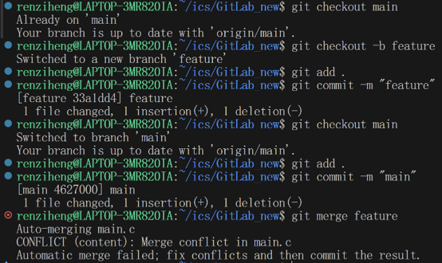
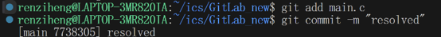

# GitLab 实验报告
 任子衡 25803060007
## 1 文档中的问题
### 1.1 
有，是使用Github分工协作的。
### 1.2
设计暂存和提交两个环节，可以做到以下几点：
#### 1 精确控制
通过选择将哪些文件放进暂存区，可以精确控制提交的内容，而不是将所有改动全部放进去：
```bash
git add fileA
git commit -m "只提交fileA"
```
或者将一次大改动分成多次小改动，使改动更加清晰。

甚至支持只提交文件中的一个代码块进暂存区：
```bash
git add -p file
```
#### 2 随时反悔
放入暂存区后，可以提前确认，如果发现内容有误，可以撤回，避免后续麻烦。

仍用前面例子举例，假设只想提交fileA：
```bash
git add . #这一行不小心全部提交
git status #发现提交文件不对
git reset fileA #改为提交fileA
```
#### 3 冲突处理
暂存区可以记录已经解决的冲突，让使用者可以有条不紊地挨个处理所有冲突。
### 1.3
git branch命令会列出所有的本地分支，输出结果大致如下：
```
  feature
* main
```
*表示目前在这个分支上。

而git branch -a命令不仅列出本地分支，还会列出远程跟踪分支，即上次pull/fetch时远程分支的状态：
```
  feature
* main
  remotes/origin/HEAD -> origin/main
  remotes/origin/main
```
其中HEAD是远程仓库 origin 的默认分支指针，->指向的是远程默认分支。

设置本地分支，可以方便使用者在自己的设备上对项目进行自由操作，在不依赖网络、不影响他人的情况下修改文件、进行实验等；远程跟踪分支则是对远程仓库状态的本地缓存，记录了上次fetch/pull时远程仓库的状态，可以作为团队协作的参照。
## 2 第一次commit
git clone后在本地将"Hello World"修改为"计算机系统基础nb"，并执行以下指令：
```bash
git add . 
git commit -m "1"
git push origin main
```
三条指令将改动先后放进暂存区、本地仓库和远程仓库。


## 3 阅读理解
### Commit Message 规范
这篇推文介绍了Commit Message应该遵守的规范。Commit Message的Angular规范如下：
```
<type>(<scope>): <subject>
// 空一行
<body>
// 空一行
<footer>
```
其中，Header为必需，type说明commit 的类别，scope用于说明 commit 影响的范围，subject是 commit 目的的简短描述。Body 部分是对本次 commit 的详细描述。

正确编写Commit Message可以清晰明了地说明提交的目的；提供更多的历史信息，方便快速浏览；便于快速查找信息；生成Change log。

本实验实践部分完成时未阅读本文，故Commit Message没有遵守规范。
### 语义化版本
为了避免“依赖地狱”，作者提出了”语义化版本控制规范“，它规定了版本号 X.Y.Z（主版本号.次版本号.修订号）的含义：

主版本号 (X)：做了不兼容的 API 修改时递增。

次版本号 (Y)：做了向下兼容的功能性新增时递增。

修订号 (Z)：做了向下兼容的问题修正时递增。

这套约定使得对开发者和用户，软件版本管理变得清晰、可靠、可预测。
### 为什么要学习Git
这两篇文章都介绍了在编程时要遵循的统一规范，学习Git可以帮助我们规范化共同协作的过程，方便追溯版本的变化，方便自己也方便合作者。
## 4 分支管理 
利用以下命令创建并切换到新分支feature：
```bash
git cheackout -b feature
```
然后将输出内容修改为"Github nb!"，并上传。然后切回main分支，讲输出内容修改为"Goodbye World"，并上传。

接着运行以下命令将feature合并到main：
```bash
git merge feature
```
发现出现了合并冲突，如图所示：


将双方不同的文本内容手动修改为"Hello World"，此时再次提交，发现冲突已经解决。



